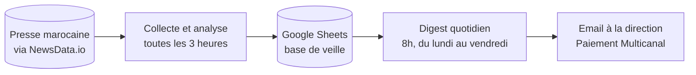
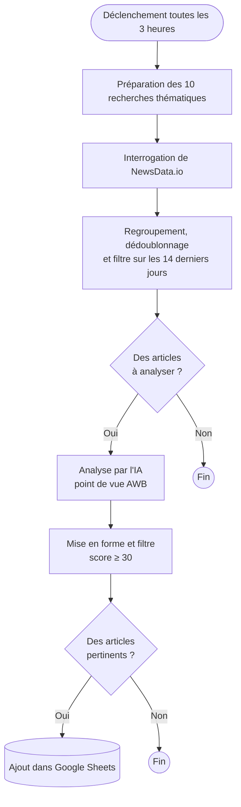
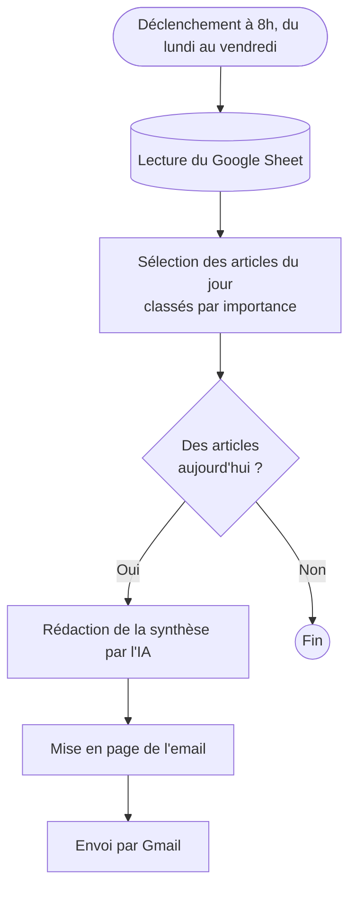

# AUTOMATED INTELLIGENCE MONITORING

### Veille stratégique automatisée sur le paiement et la fintech au Maroc

Suivre l'actualité du paiement au Maroc prend du temps. Les annonces des banques concurrentes, les nouvelles fintechs, les circulaires de Bank Al-Maghrib et les projets de digitalisation publique sont publiés dans des dizaines de médias différents. Le plus difficile n'est pas de trouver l'information, mais de repérer vite ce qui compte vraiment pour la banque.

Ce projet automatise ce travail. Plusieurs fois par jour, il collecte les articles de presse marocains sur ces sujets. Il les fait lire par un modèle d'IA qui raisonne comme un analyste de la division Paiement Multicanal d'Attijariwafa Bank, et ne conserve que ce qui mérite de l'attention. Chaque matin, un digest arrive par email avec l'essentiel de la veille.

L'objectif n'est pas d'obtenir des résumés d'articles, mais des réponses à des questions métier :

- Est-ce que ce sujet concerne notre activité ?
- Un concurrent est-il en train de prendre de l'avance ?
- Y a-t-il une opportunité de partenariat ou de positionnement ?
- Que devrait-on faire concrètement ?

---

## Comment ça fonctionne

Le système repose sur deux automatisations indépendantes, construites avec [n8n](https://n8n.io). Google Sheets sert de base de données entre les deux.

La première automatisation alimente la base en continu. La seconde la relit chaque matin pour en tirer une synthèse. Cette séparation permet de consulter la base à tout moment dans le Google Sheet, sans attendre le digest.

---

## 1. Collecte et analyse des articles

Toutes les trois heures, le système interroge NewsData.io avec dix recherches thématiques qui couvrent le périmètre de la veille :

| Thème | Exemples de mots-clés |
|---|---|
| Paiement et monétique | wallet, paiement mobile, TPE, QR code, SoftPOS, sans contact |
| Acteurs du paiement | CMI, HPS, Visa, Mastercard |
| Banques concurrentes | CIH Bank, BMCE, Banque Populaire, Société Générale Maroc |
| Régulation | Bank Al-Maghrib, agréments de paiement, cadre fintech |
| Secteur public | e-gov, CNSS, DGI, CMR, paiement en ligne des administrations |
| Marché et innovation | startups, e-commerce, open banking, BNPL |

Seuls les articles publiés au Maroc, en français, au cours des 14 derniers jours sont retenus. Les doublons sont supprimés, car un même article peut remonter dans plusieurs recherches.

Les articles sont ensuite envoyés au modèle de langage (Llama 3.3 70B via Groq). Pour chacun, le modèle rédige une fiche d'analyse : un résumé, une catégorie, le type de signal, les acteurs cités et un niveau d'importance. Il indique surtout, du point de vue d'AWB, **l'opportunité à saisir, la menace à surveiller et une action recommandée**. Ces deux derniers champs sont obligatoires dans les consignes du modèle, pour éviter les analyses génériques.

Enfin, chaque article reçoit un score de pertinence sur 100. Seuls ceux qui atteignent 30 sont enregistrés dans le Google Sheet.

Fichier n8n : [`workflows/veille-agent-newsdata.json`](workflows/veille-agent-newsdata.json)

---

## 2. Digest quotidien

Chaque jour ouvré à 8h, le système relit les articles collectés depuis minuit. Il privilégie ceux dont l'importance est élevée ou moyenne, puis demande à un second modèle (GPT-4o mini) de rédiger une note de synthèse comme le ferait un directeur de l'intelligence stratégique.

Le digest contient :

- une synthèse de la journée en quelques phrases ;
- les cinq signaux les plus importants, classés par urgence ;
- les trois principales opportunités et les trois principales menaces, chacune avec une piste d'action ;
- les initiatives des banques concurrentes ;
- la recommandation prioritaire du jour.

Il est mis en page en HTML aux couleurs de la banque, puis envoyé par Gmail. S'il n'y a rien de nouveau, aucun email n'est envoyé.

Fichier n8n : [`workflows/digest-quotidien.json`](workflows/digest-quotidien.json)

---

## Ce que contient le Google Sheet

Chaque ligne de l'onglet **Veille** correspond à un article retenu et contient :

- **l'identification de l'article** : date de collecte, titre, source, lien, date de publication ;
- **la lecture de l'article** : résumé, catégorie, type de signal, acteurs cités, banque concurrente concernée ;
- **l'analyse pour AWB** : importance, opportunité, menace, impact, action recommandée ;
- **le suivi** : une colonne *Statut* pour indiquer si l'article a été lu ou traité.

Le classeur contient aussi un onglet **Digest**, qui garde l'historique des synthèses envoyées, et un onglet **Sources**, qui liste les sources suivies.

Pour créer ce classeur avec la bonne mise en forme, utilisez le script [`scripts/google_sheet_init.gs`](scripts/google_sheet_init.gs).

---

## Mise en place

Vous aurez besoin de :

- une instance n8n (la version Docker suffit) ;
- une clé API NewsData.io (l'offre gratuite suffit pour démarrer) ;
- une clé API Groq ;
- une clé API OpenAI, pour le digest ;
- un compte Google, pour Sheets et Gmail.

**Étape 1 : créer le Google Sheet.** Ouvrez un classeur vide, allez dans *Extensions > Apps Script*, collez le contenu de `scripts/google_sheet_init.gs` puis lancez-le. Notez l'identifiant du classeur, visible dans son URL.

**Étape 2 : importer les workflows.** Dans n8n, allez dans *Import from file* et sélectionnez les deux fichiers du dossier `workflows/`.

**Étape 3 : renseigner vos accès.** Pour des raisons de sécurité, les clés ont été retirées des fichiers. Remplacez les valeurs suivantes dans les nœuds concernés :

| À remplacer | Où |
|---|---|
| `VOTRE_CLE_NEWSDATA` | Appel NewsData |
| `VOTRE_CLE_GROQ` | Analyser avec Groq |
| `VOTRE_CLE_OPENAI` | Générer Digest OpenAI |
| `VOTRE_SPREADSHEET_ID` | Nœuds Google Sheets |
| `destinataire@exemple.com` | Envoyer Digest Email |

**Étape 4 : connecter Google.** Dans n8n, créez les accès OAuth2 pour Google Sheets et Gmail. L'URL de retour à déclarer dans la console Google est `http://localhost:5678/rest/oauth2-credential/callback`.

**Étape 5 : activer les deux workflows.**

---

## Adapter la veille

Le système est conçu pour évoluer sans toucher à son architecture.

- **Suivre un nouveau sujet** : ajoutez une ligne de recherche dans le nœud *Liste des requêtes*.
- **Être plus ou moins sélectif** : changez le seuil de 30 dans le nœud *Parser résultats*.
- **Affiner le regard métier** : les consignes données à l'IA se trouvent dans le nœud *Agréger articles*. C'est là que l'on précise les concurrents, les catégories et la façon de juger l'importance.
- **Changer la fréquence** : modifiez les déclencheurs en tête de chaque workflow.

---

## Limites connues et prochaines étapes

Ce projet est un MVP. Il a été pensé pour être utile rapidement, pas pour tout couvrir dès le départ.

- La collecte s'appuie uniquement sur la presse indexée par NewsData.io. Les réseaux sociaux et les sites institutionnels ne sont pas encore couverts. L'ajout des pages LinkedIn de CMI, HPS et CIH Bank est prévu.
- Pour garantir la qualité de l'analyse, le nombre d'articles traités à chaque passage est limité à huit.
- Le digest quotidien est encore en phase de test. À terme, il utilisera le même modèle que l'analyse, afin de ne dépendre que d'un seul fournisseur.
- Une première version basée sur des flux RSS a été abandonnée, car elle remontait trop peu de résultats. Elle est conservée dans [`workflows/archive/`](workflows/archive/).

Le cahier des charges complet du projet est disponible dans [`docs/cahier-des-charges.md`](docs/cahier-des-charges.md).
