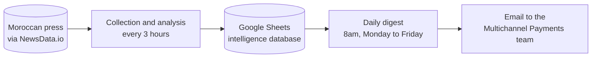
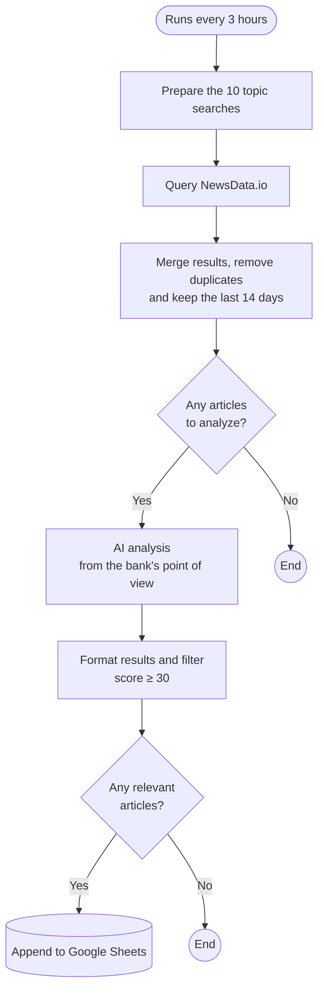
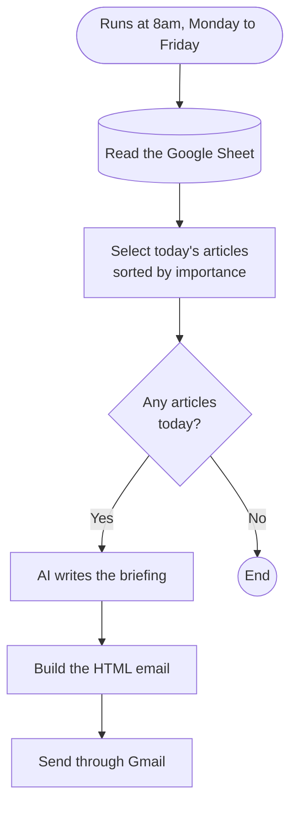

# Automated Intelligence Monitoring

### Automated market intelligence on payments and fintech in Morocco

Keeping up with the Moroccan payments market takes time. Competitor bank announcements, new fintechs, Bank Al-Maghrib circulars and public-sector digitalization projects are spread across dozens of news outlets. Finding the information is not the hard part. The hard part is spotting quickly what actually matters for the bank.

This project automates that work. Several times a day, it collects Moroccan news articles on these topics. An AI model reads them the way an analyst from Attijariwafa Bank's Multichannel Payments team would, and keeps only what deserves attention. Every morning, a digest with the key takeaways lands in your inbox.

The goal is not to summarize articles. It is to answer business questions:

- Does this affect our business?
- Is a competitor getting ahead of us?
- Is there a partnership or positioning opportunity?
- What should we actually do about it?

---

## How it works

The system runs on two independent automations built with [n8n](https://n8n.io). Google Sheets acts as the database between them.

The first automation keeps the database up to date throughout the day. The second reads it every morning and turns it into a summary. Because the two are separate, you can open the Google Sheet at any time without waiting for the digest.

---

## 1. Collecting and analyzing articles

Every three hours, the system runs ten topic-based searches on NewsData.io:

| Topic | Sample keywords |
|---|---|
| Payments and card processing | wallets, mobile payments, POS terminals, QR codes, SoftPOS, contactless |
| Payment players | CMI, HPS, Visa, Mastercard |
| Competitor banks | CIH Bank, BMCE, Banque Populaire, Société Générale Maroc |
| Regulation | Bank Al-Maghrib, payment licenses, fintech framework |
| Public sector | e-government, CNSS, DGI, CMR, online payment of public services |
| Market and innovation | startups, e-commerce, open banking, BNPL |

Only French-language articles from Moroccan sources, published in the last 14 days, are kept. Duplicates are removed, since the same article often comes up in several searches.

The articles are then sent to a language model (Llama 3.3 70B, via Groq). For each one, the model writes a short analysis: a summary, a category, the type of signal, the companies involved and an importance level. Most importantly, it spells out from the bank's point of view **the opportunity to seize, the threat to watch and a recommended action**. The model is required to fill in the opportunity and the threat, so it cannot fall back on generic comments.

Finally, each article gets a relevance score out of 100. Only articles scoring 30 or more are saved to the Google Sheet.

n8n file: [`workflows/veille-agent-newsdata.json`](workflows/veille-agent-newsdata.json)

---

## 2. Daily digest

Every weekday at 8am, the system reads the articles collected since midnight. It focuses on the ones rated high or medium importance, then asks a second model (GPT-4o mini) to write a briefing note, the way a head of strategic intelligence would.

The digest includes:

- a short overview of the day;
- the five most important signals, ranked by urgency;
- the top three opportunities and the top three threats, each with a suggested action;
- notable moves by competitor banks;
- the one priority to focus on today.

It is laid out as an HTML email in the bank's colors and sent through Gmail. If there is nothing new, no email goes out.

n8n file: [`workflows/digest-quotidien.json`](workflows/digest-quotidien.json)

---

## What's in the Google Sheet

Each row in the **Veille** tab is one selected article. It holds:

- **the article itself**: collection date, title, source, link, publication date;
- **what it's about**: summary, category, signal type, companies mentioned, competitor bank involved;
- **what it means for the bank**: importance, opportunity, threat, impact, recommended action;
- **follow-up**: a *Statut* column to mark whether the article has been read or acted on.

The spreadsheet also has a **Digest** tab, which keeps a history of the briefings sent, and a **Sources** tab, which lists the sources being monitored.

To create the spreadsheet with the right layout, run the script in [`scripts/google_sheet_init.gs`](scripts/google_sheet_init.gs).

---

## Getting started

You will need:

- an n8n instance (the Docker version is enough);
- a NewsData.io API key (the free plan is enough to start);
- a Groq API key;
- an OpenAI API key, for the digest;
- a Google account, for Sheets and Gmail.

**Step 1: create the Google Sheet.** Open a blank spreadsheet, go to *Extensions > Apps Script*, paste the content of `scripts/google_sheet_init.gs` and run it. Write down the spreadsheet ID; you'll find it in the URL.

**Step 2: import the workflows.** In n8n, choose *Import from file* and select the two files in the `workflows/` folder.

**Step 3: add your credentials.** API keys have been removed from the files for security reasons. Replace these values in the matching nodes:

| Replace | In node |
|---|---|
| `VOTRE_CLE_NEWSDATA` | Appel NewsData |
| `VOTRE_CLE_GROQ` | Analyser avec Groq |
| `VOTRE_CLE_OPENAI` | Générer Digest OpenAI |
| `VOTRE_SPREADSHEET_ID` | Google Sheets nodes |
| `destinataire@exemple.com` | Envoyer Digest Email |

**Step 4: connect Google.** In n8n, set up OAuth2 credentials for Google Sheets and Gmail. The redirect URL to add in the Google Cloud console is `http://localhost:5678/rest/oauth2-credential/callback`.

**Step 5: activate both workflows.**

---

## Customizing the monitoring

The system is designed to evolve without changing its architecture. The n8n nodes keep their original French names.

- **Track a new topic**: add a search line in the *Liste des requêtes* node.
- **Be more or less selective**: change the threshold of 30 in the *Parser résultats* node.
- **Sharpen the business judgment**: the instructions given to the AI are in the *Agréger articles* node. That is where you define the competitors, the categories and how importance is assessed.
- **Change the frequency**: edit the trigger at the start of each workflow.

---

## Known limitations and next steps

This is an MVP. It was built to be useful quickly, not to cover everything from day one.

- Collection relies only on news indexed by NewsData.io. Social media and institutional websites are not covered yet. Adding the LinkedIn pages of CMI, HPS and CIH Bank is planned.
- To keep the analysis accurate, each run processes at most eight articles.
- The daily digest is still being tested. It will eventually use the same model as the analysis, so the project depends on a single AI provider.
- An earlier version based on RSS feeds was dropped because it returned too few results. It is kept in [`workflows/archive/`](workflows/archive/).

The full project specification (in French) is available in [`docs/cahier-des-charges.md`](docs/cahier-des-charges.md).
