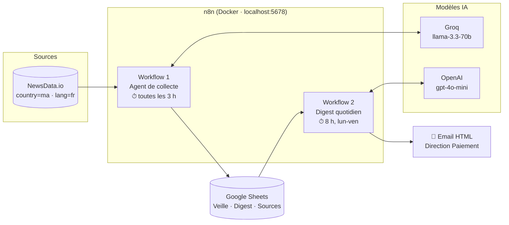
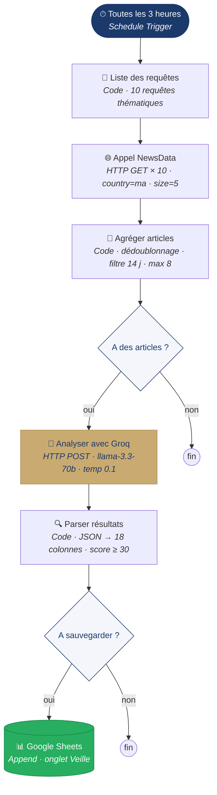
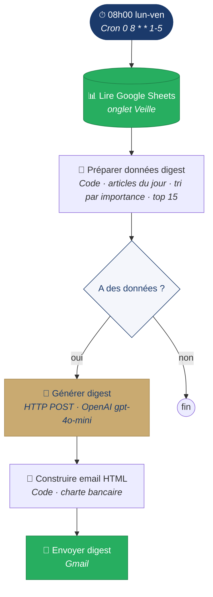
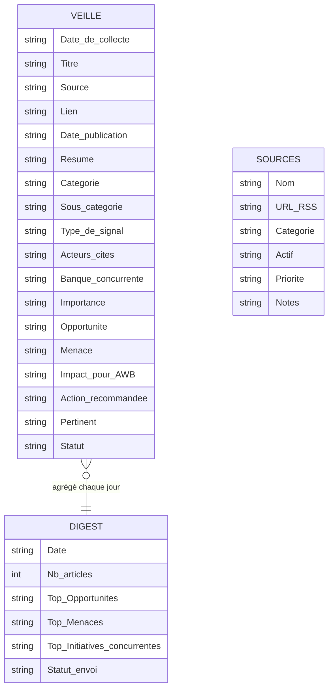

# Veille stratégique automatisée — Paiement multicanal au Maroc

MVP d'un outil de **veille stratégique automatisée** construit avec **n8n**. Il surveille l'écosystème du paiement, de la fintech et de la concurrence bancaire au Maroc, et produit une **lecture business** des actualités. Les signaux sont analysés du point de vue d'Attijariwafa Bank (AWB) : opportunités, menaces, initiatives concurrentes et actions recommandées.

> La question à laquelle l'outil répond :
> *« Quelles sont les nouveautés importantes dans le paiement et la fintech au Maroc qui représentent une opportunité, une menace ou un signal à suivre pour Attijariwafa Bank ? »*

---

## Ce que fait le projet

| Étape | Ce qui se passe |
|---|---|
| **Collecte** | Toutes les 3 h, 10 requêtes thématiques sont envoyées à l'API NewsData.io (articles marocains, en français, des 14 derniers jours). |
| **Nettoyage** | Les articles sont agrégés, dédoublonnés par lien, puis limités à 8 par lot pour que la réponse du LLM ne soit pas tronquée. |
| **Analyse IA** | Le modèle Groq (`llama-3.3-70b-versatile`) classe chaque article et produit une analyse structurée orientée AWB. |
| **Filtrage** | Seuls les articles dont le score de pertinence est d'au moins 30/100 sont conservés. |
| **Stockage** | Les signaux retenus sont ajoutés dans Google Sheets (18 colonnes). |
| **Diffusion** | Du lundi au vendredi à 8 h, un digest HTML est généré et envoyé par Gmail : top signaux, opportunités, menaces et initiatives concurrentes. |

### Axes de veille couverts

- **Concurrence bancaire** : CIH Bank, Banque Populaire, BMCE / Bank of Africa, Société Générale Maroc, BMCI, Crédit du Maroc, CFG Bank, Al Barid Bank
- **Paiement multicanal** : wallet, monétique, TPE, QR code, SoftPOS, sans contact, cartes
- **Fintech** : CMI, HPS, startups, PSP, e-commerce
- **Régulation** : Bank Al-Maghrib, agréments, cadre fintech
- **Secteur public** : e-gov, CNSS, DGI, CMR, paiement en ligne des administrations
- **Innovation** : open banking, BNPL, embedded finance

---

## Architecture globale



---

## Workflow 1 : Agent de collecte et d'analyse

Fichier : [`workflows/veille-agent-newsdata.json`](workflows/veille-agent-newsdata.json)



### Ce que produit l'analyse Groq pour chaque article

| Champ | Contenu |
|---|---|
| `resume` | Résumé en 1 phrase |
| `categorie` | Paiement multicanal · Banque concurrente · Fintech · Régulation · Service public · E-commerce · Innovation · Partenariat · Autre |
| `type_signal` | Lancement produit · Partenariat · Évolution réglementaire · Initiative concurrente · Digitalisation · Opportunité marché · Tendance émergente · Information générale |
| `acteurs_cites`, `banque_concurrente` | Entités détectées |
| `importance` | Élevée · Moyenne · Faible |
| `opportunite` | Comment AWB peut en profiter concrètement (**obligatoire**) |
| `menace` | Quel risque pour AWB ou quel avantage pour un concurrent (**obligatoire**) |
| `impact_awb`, `action_recommandee` | Impact et action concrète pour AWB |
| `score` | 0-29 non pertinent · 30-59 pertinent · 60-100 très pertinent |

---

## Workflow 2 : Digest quotidien par email

Fichier : [`workflows/digest-quotidien.json`](workflows/digest-quotidien.json)



Le digest contient :

- une **synthèse exécutive** (3-4 phrases) ;
- les **5 signaux** les plus importants, avec leur urgence ;
- les **3 opportunités** principales et l'action associée ;
- les **3 menaces** principales et l'action associée ;
- les **initiatives concurrentes** du jour ;
- la **recommandation du jour**.

---

## Modèle de données (Google Sheets)

Le script [`scripts/google_sheet_init.gs`](scripts/google_sheet_init.gs) (Google Apps Script) crée le classeur avec 3 onglets :



---

## Structure du dépôt

```
.
├── README.md
├── workflows/
│   ├── veille-agent-newsdata.json   # Workflow 1 : collecte + analyse Groq (actif)
│   ├── digest-quotidien.json        # Workflow 2 : digest email quotidien
│   └── archive/
│       └── collection-rss.json      # Première version basée sur des flux RSS (abandonnée)
├── scripts/
│   └── google_sheet_init.gs         # Initialisation du Google Sheet
└── docs/
    └── cahier-des-charges.md        # Cahier des charges du MVP
```

---

## Installation

### Prérequis

- [n8n](https://n8n.io) (par exemple `docker run -it --rm -p 5678:5678 n8nio/n8n`)
- Une clé API [NewsData.io](https://newsdata.io) (le plan gratuit suffit)
- Une clé API [Groq](https://console.groq.com)
- Une clé API [OpenAI](https://platform.openai.com), pour le digest
- Un compte Google (Sheets et Gmail)

### Étapes

1. **Créer le Google Sheet** : ouvrez un nouveau classeur, allez dans *Extensions → Apps Script*, collez `scripts/google_sheet_init.gs`, puis exécutez-le. Notez l'ID du classeur (dans l'URL).
2. **Importer les workflows dans n8n** : *Workflows → Import from file*, puis sélectionnez les fichiers de `workflows/`.
3. **Remplacer les placeholders** dans les nœuds :

   | Placeholder | Nœud concerné |
   |---|---|
   | `VOTRE_CLE_NEWSDATA` | Appel NewsData |
   | `VOTRE_CLE_GROQ` | Analyser avec Groq |
   | `VOTRE_CLE_OPENAI` | Générer Digest OpenAI |
   | `VOTRE_SPREADSHEET_ID` | Nœuds Google Sheets |
   | `destinataire@exemple.com` | Envoyer Digest Email |

4. **Configurer les credentials OAuth2** Google Sheets et Gmail dans n8n (URL de callback : `http://localhost:5678/rest/oauth2-credential/callback`).
5. **Activer** les deux workflows.

> ⚠️ Ne committez jamais de vraies clés API. Stockez-les de préférence dans les *Credentials* n8n plutôt que dans les paramètres des nœuds.

---

## Personnalisation

- **Ajouter un thème de veille** : modifiez le nœud *Liste des requêtes* (une ligne `{ json: { q: '...' } }` par requête).
- **Changer le seuil de pertinence** : modifiez `>= 30` dans le nœud *Parser résultats*.
- **Ajuster la logique métier** : le prompt système se trouve dans le nœud *Agréger articles* (champ `payload.messages[0].content`).
- **Changer la fréquence** : modifiez les nœuds *Schedule Trigger*.

---

## Feuille de route

- [x] Collecte NewsData.io, analyse Groq et stockage Google Sheets
- [ ] Tester et valider le digest quotidien
- [ ] Faire passer le digest de OpenAI à Groq (pour n'utiliser qu'un seul fournisseur)
- [ ] Ajouter la veille LinkedIn via rss.app (CMI, HPS, CIH Bank)
- [ ] Mettre en place un scoring avancé et un tableau de bord
